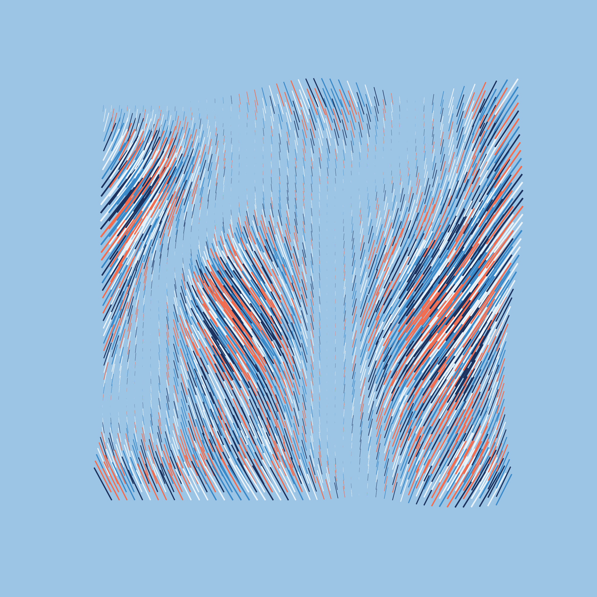
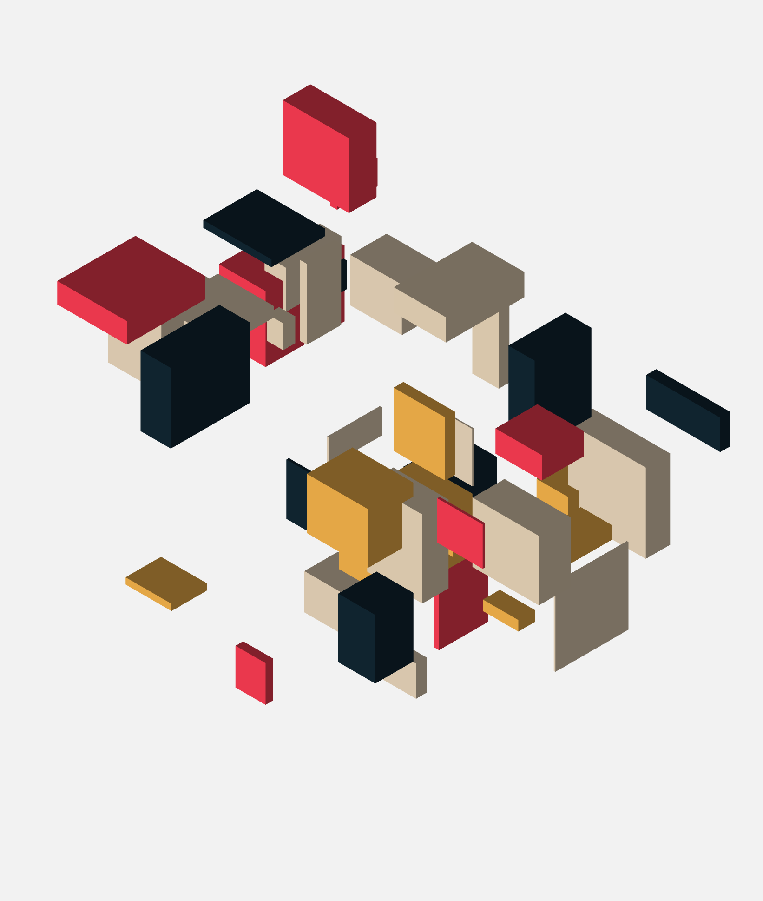

# Generative artwork

Several attempts to create generative artwork using canvas-sketch.

## Installation

    $ git clone git@github.com:sonickonic/generative-art.git
    $ cd generative-art
    $ npm install

## Run the app

    $ npm start

## Outputs

